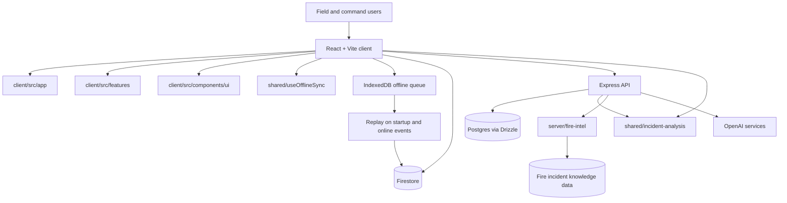
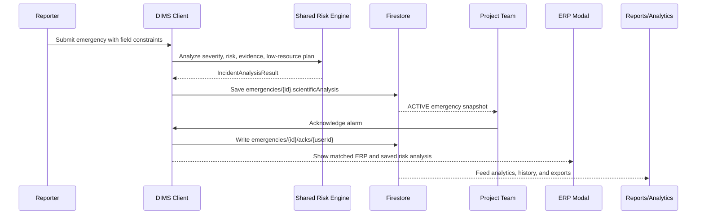
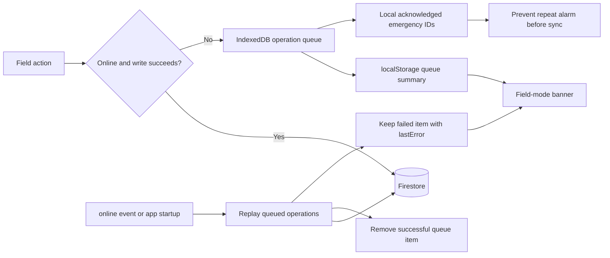
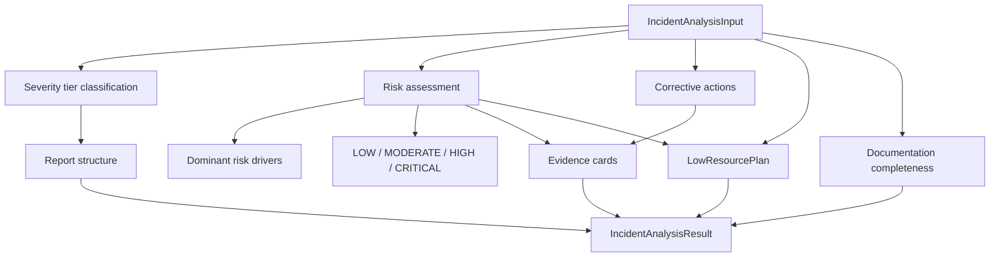

# DIMS: Dynamic Incident Management System

DIMS, currently branded in the UI as HydroSafe, is an evidence-informed incident management and emergency response platform for offshore, industrial, marine, construction, mining, and other high-risk field operations.

The project is built for teams that need fast command decisions, auditable incident evidence, and resilient operation in low-connectivity environments. It combines deterministic risk scoring, ERP retrieval, emergency mustering, field observations, project analytics, and offline write replay.

## What Evidence-Informed Means

Evidence-informed means DIMS does not treat AI output as a black-box decision. Incident analysis uses explicit, measurable, and repeatable risk logic across severity, likelihood, consequence, exposure, vulnerability, detectability gaps, and resource strain. Each analysis includes evidence cards, dominant risk drivers, confidence, uncertainty notes, low-resource constraints, and documentation checks so responders can audit why a recommendation was made.

## Target Users

- Bronze/frontline responders who need simple field capture, emergency acknowledgments, and minimum-data reporting.
- Silver/tactical controllers who need evidence cards, ERP steps, team status, and replayable incident timelines.
- Gold/strategic leaders who need evidence-informed escalation signals, audit trails, reports, and project-wide risk visibility.
- HSE, compliance, and client representatives who need defensible documentation across incidents, observations, assets, and emergency drills.

## Core Capabilities

| Domain | What it Does |
| --- | --- |
| Emergency response | Emergency submission, project-wide alarm, mustering acknowledgments, post-ack ERP guidance, live ack list. |
| Evidence-informed incident analysis | Shared deterministic scoring for severity, likelihood, consequence, exposure, vulnerability, detectability gap, and resource strain. |
| Low-resource mode | Offline queue, local acknowledgment memory, queue banner, delayed Firestore replay, minimum-data field guidance. |
| Incidents and observations | Incident creation, risk analysis panel, photo workflow, near-miss and observation submission. |
| ERP and Fire Intelligence | ERP protocol search, AI advisor surfaces, historical fire-incident matching, emergency protocol pages. |
| Environment | Environmental context cards, space weather widget, Earth/operations globe, Fire Guard view. |
| Analytics | Project analytics dashboard, incident history, response metrics, risk-aware Excel/PDF exports. |
| Assets | Asset register, uploads, detail pages, and asset AI chat. |
| Team and roles | Bronze/Silver/Gold role flows, team management, hierarchy, headcount/muster map, online tracking. |
| Reports and compliance | Audit trail, risk analysis audit entries, report generation surfaces, compliance placeholders. |

## Architecture



## Incident Lifecycle



## Low-Resource Offline Sync



Queued operation kinds:

- `emergency_ack`
- `emergency_submit`
- `near_miss_submit`
- `observation_submit`

## Evidence-Informed Risk Engine



The engine is deterministic and shared by client and server through `shared/incident-analysis`. This keeps offline fallback behavior aligned with the server API.

Risk dimensions:

- Consequence
- Likelihood
- Exposure
- Vulnerability
- Detectability gap
- Resource strain

Public API:

```http
POST /api/incidents/analyze
Content-Type: application/json

{
  "title": "Gas leak near engine room",
  "description": "Gas alarm activated with intermittent comms and delayed evacuation.",
  "category": "Accident",
  "resourceConstraints": {
    "connectivity": "intermittent",
    "power": "limited",
    "evacuationAccess": "delayed",
    "medicalAccessMinutes": 45,
    "languageCoverage": "multilingual"
  }
}
```

Response fields:

- `severity`
- `risk`
- `actions`
- `evidenceCards`
- `lowResourcePlan`
- `documentation`
- `reportStructure`
- `analysisVersion`
- `generatedAt`

Emergency Firestore persistence:

```ts
emergencies/{id}.scientificAnalysis = {
  analysisVersion,
  generatedAt,
  generatedBy,
  source: "server" | "client-offline-fallback",
  severity,
  risk,
  evidenceCards,
  lowResourcePlan,
  documentation
}
```

## Fire Intelligence and ERP Retrieval

```mermaid
flowchart TB
  IncidentText[Incident text and context] --> Normalize[Normalize keywords and scenario terms]
  Normalize --> DirectMatch[Direct ERP keyword match]
  Normalize --> FuzzyMatch[Fuse.js fuzzy ERP match]
  Normalize --> FireIntel[Fire Intelligence matcher]
  FireIntel --> Geo[Geographic and environmental similarity]
  FireIntel --> Historical[Historical incident lessons]
  DirectMatch --> ERP[Matched ERP protocol]
  FuzzyMatch --> ERP
  Historical --> Advisor[AI/Fire Intelligence answer surfaces]
  ERP --> EmergencyRecord[emergencies/{id}.matchedERP]
  EmergencyRecord --> PostAck[Post-acknowledgment ERP modal]
```

## Data Storage

| Store | Used For | Notes |
| --- | --- | --- |
| Firestore | Emergencies, acknowledgments, observations, ERP protocols, assets, team members, project data. | First persistence target for emergency risk analysis and offline replay. |
| Postgres/Drizzle | Users, projects, API incidents, audit logs, clients, structured backend records. | Used by Express routes in `server/routes.ts` and `server/storage.ts`. |
| IndexedDB | Offline queue operations. | Database `dims-offline-queue`, store `operations`. |
| localStorage | Auth token/user, selected role, queue summary, local acknowledged emergency IDs. | Queue summary powers the field-mode banner. |

## Folder Classification Map

```text
client/src/
  app/                  App shell, providers, route composition, persistent nav, headers, not-found, error boundary.
  features/
    emergency/          Emergency modal, alarm modal, post-ack ERP modal, alarm hook, command dashboard.
    incidents/          Incidents page, analysis panel, incident photo modal.
    erp/                ERP search, ERP modal, AI ERP advisor, emergency protocols page.
    environment/        Environmental cards, Fire Guard, globe, space weather, environmental data.
    analytics/          Project analytics dashboard and AI analytics tab.
    assets/             Asset pages, upload/manage/detail flows, asset AI chat.
    projects/           Project setup, project switcher, project header.
    team/               Team management, hierarchy, role picker/code modal, headcount map.
    clients/            Client page, client cards, client forms.
    reports/            Reports page, audit trail, compliance dashboard.
    auth/               Login, register, profile, profile menu.
  lib/                  Cross-cutting clients/utilities: query client, auth events, online tracking, offline queue.
  hooks/                Reusable React hooks.
  types/                Shared frontend types.
  components/ui/        Reusable design-system primitives only.
```

Moved legacy categories:

| Old Category | New Home |
| --- | --- |
| `client/src/pages/*` | `client/src/features/<domain>/*Page.tsx` or `client/src/app/not-found.tsx` |
| Feature components from `client/src/components/*` | `client/src/features/<domain>/` |
| `client/src/components/ui/*` | Stays in `client/src/components/ui/*` |
| `client/src/utils/useProjectEmergencyAlarm.ts` | `client/src/features/emergency/useProjectEmergencyAlarm.ts` |
| `client/src/utils/environmental-data.ts` | `client/src/features/environment/environmental-data.ts` |
| `client/src/utils/ai-recommendations.ts` | `shared/incident-analysis` |
| Cross-client utilities | `client/src/lib/*` |
| Shared domain logic | `shared/*` |
| Backend API routes | `server/routes.ts` for this pass |

Import policy:

- Use `@/features/...` for feature imports.
- Use `@/app/...` for app-shell imports.
- Use `@/lib/...`, `@/hooks/...`, and `@/types` for cross-cutting frontend code.
- Use `@/components/ui/...` only for design-system primitives.
- Use `@shared/...` for client/server shared logic and types.

## Research Influences

The current low-resource design is intentionally conservative: deterministic scoring, offline-first capture, minimum-data reporting, delayed sync, and auditability. It aligns with themes in recent emergency and low-resource digital systems research, including offline field capture, decision support, and resilient response workflows.

Useful references for future risk-engine upgrades:

- [FirstAidQA: A Data-Centric and Expert-Informed Benchmark for First Aid Question Answering](https://arxiv.org/abs/2511.01289)
- [OPTIC-ER: An Open Dataset for Emergency Room Clinical Case Reports](https://arxiv.org/abs/2503.00687)
- [Adaptive task allocation in human-AI teaming under resource constraints](https://www.nature.com/articles/s41598-025-12974-3)
- [A New Perspective on Emergency Response Systems in Intelligent Remote Communities](https://www.mdpi.com/1424-8220/25/19/6085)

## Setup

Requirements:

- Node.js 20+
- npm
- Postgres database URL for backend persistence
- Firebase project for Firestore/Auth
- Optional OpenAI API key for AI advisor features

Install dependencies:

```bash
npm install
```

Run development server:

```bash
npm run dev
```

Build production assets:

```bash
npm run build
```

Start production server after build:

```bash
npm start
```

Push Drizzle schema:

```bash
npm run db:push
```

## Environment Variables

| Variable | Required | Purpose |
| --- | --- | --- |
| `DATABASE_URL` | Yes | Postgres/Neon connection string. |
| `JWT_SECRET` | Yes in production | Auth and role-token signing. |
| `OPENAI_API_KEY` | Optional | Enables OpenAI-backed advisor and analytics features. |
| `OPENAI_API_KEY_ENV_VAR` | Optional | Fallback OpenAI key name used by older code paths. |
| `GOOGLE_CLIENT_ID` | Optional | Google OAuth. |
| `GOOGLE_REDIRECT_URI` | Optional | Google OAuth callback URL. |
| `APPLE_CLIENT_ID` | Optional | Apple OAuth. |
| `APPLE_REDIRECT_URI` | Optional | Apple OAuth callback URL. |
| `BRONZE_CODE` | Optional | Role switch code for Bronze. |
| `SILVER_CODE` | Optional | Role switch code for Silver. |
| `GOLD_CODE` | Optional | Role switch code for Gold. |
| `PORT` | Optional | Express server port, defaults to `5000`. |
| `VITE_SOCKET_URL` | Optional | Client socket endpoint, defaults to current origin. |

Firebase configuration currently lives in `client/src/firebase.ts`. For production hardening, move that config to `VITE_FIREBASE_*` environment variables.

## Testing and Verification

Run static type checks:

```bash
npm run check
```

Run tests:

```bash
npm test
```

Run production build:

```bash
npm run build
```

Recommended verification scenarios:

- Emergency acknowledgment online writes exactly once to `emergencies/{id}/acks/{userId}`.
- Emergency acknowledgment offline queues exactly once and does not re-trigger the alarm.
- Reconnect replays queued acknowledgment and clears it from IndexedDB.
- Emergency submission stores `resourceConstraints` and `scientificAnalysis`.
- Post-ack ERP modal displays saved evidence-informed risk context.
- Analytics history and Excel export include risk band, score, confidence, field mode, and analysis version.
- README Mermaid diagrams render on GitHub.

Current automated tests cover:

- Risk score banding.
- Dominant risk driver ordering.
- Evidence card generation.
- Low-resource mode selection.
- Offline queue enqueue/list/remove.
- Offline queue replay and failure queuing.

## Known Limitations

- The evidence-informed risk engine is deterministic decision support, not a replacement for qualified command judgment.
- Firestore remains the first persistence target for emergency risk analysis; API incident records do not yet persist the full analysis payload in Postgres.
- Firebase client config is still hard-coded and should be moved to environment variables.
- Some report-generation and compliance dashboard surfaces are still placeholders.
- Photo/offline media sync is text-first; large evidence uploads need a dedicated resumable sync path.
- Backend routes are still consolidated in `server/routes.ts`; only the frontend was reorganized in this pass.

## Roadmap

- Persist analysis snapshots for API-created incidents in Postgres.
- Add conflict resolution UI for queued offline edits.
- Add multilingual controlled-vocabulary capture for field observations.
- Expand Fire Intelligence with richer historical incident metadata and confidence scoring.
- Add resumable offline media upload.
- Split backend routes into domain modules after the frontend structure stabilizes.
- Add Playwright smoke tests for emergency acknowledgment and offline replay flows.
